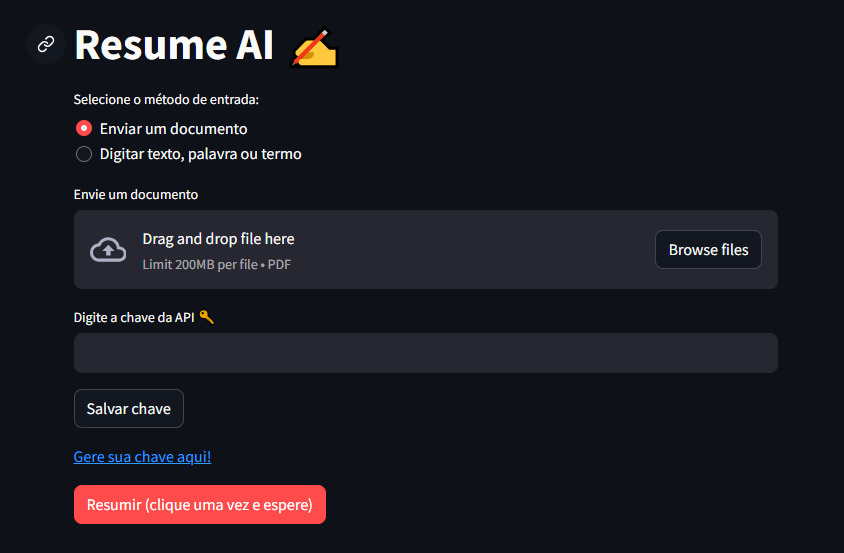

# Resume AI ✍️: Resumos Automáticos com Inteligência Aritificial (Google AI Studio)

O **Resume AI** é uma ferramenta que utiliza a API do Google e a inteligência artificial para gerar resumos automáticos a partir de textos e documentos.



## Recursos:

-  📦 **Upload Simples:** Os usuários podem enviar arquivos (PDFs).
  
- 💡 **Resumos Instantâneos:** A IA do Google Generative permite gerar resumos precisos e rápidos do conteúdo fornecido.
  
- 😃 **Visualização Amigável**: Explore seus resumos de forma organizada e fácil de entender.
  
- 📲 **Acesso em Qualquer Lugar**: Use o **Resume AI** aplicação em qualquer dispositivo com acesso à internet.

## Benefícios

- ⌚️ **Economia de Tempo:** Ao utilizar o Resume AI para gerar resumos instantâneos, você economiza tempo valioso que pode ser direcionado para outras tarefas prioritárias.
  
- 🧱 **Aumento da Produtividade:** Tome decisões mais rápidas e eficazes com base nos resumos claros e concisos gerados pelo Resume AI, impulsionando a produtividade do seu trabalho.

## Índice

1. Instalação
2. Utilização
3. Como funciona
4. Observações
5. Contato

## Instalação

**Pré-requisitos:**

- Python 3.6 ou superior
- Pip
- Chave API <span style="color:blue;">G</span> <span style="color:red;">o</span> <span style="color:yellow;">o</span> <span style="color:blue;">g</span> <span style="color:green;">e</span> <span style="color:red;">e</span> Ai Studio

**Passos:**

1. Clone o repositório:
   ```bash
   git clone https://github.com/chulipinho/summit
