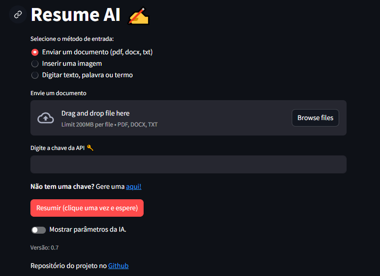
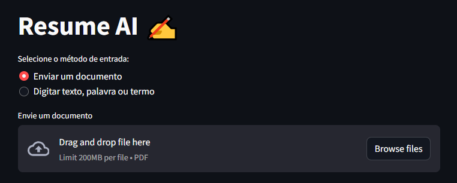
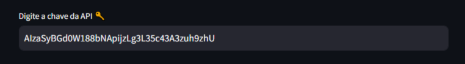
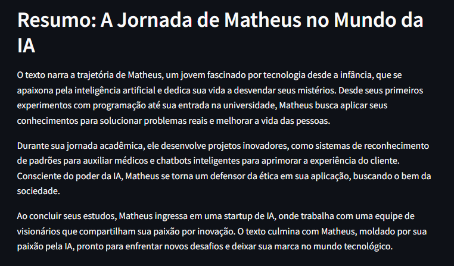
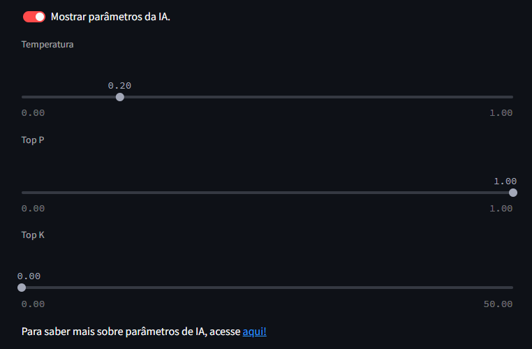

# Resume AI ✍️: Resumos Automáticos com Inteligência Artificial (Google Gemini)

O **Resume AI** é uma ferramenta que utiliza a inteligência artificial do Google para gerar resumos automáticos a partir de imagens, documentos e textos. **Versão: 0.7**



## Recursos:

-  📦 **Upload Simples:** Os usuários podem enviar **imagens** (png, jpg ou jpeg), **documentos** (pdf, docx ou txt) ou até mesmo **digitar seu próprio texto**.
  
- 💡 **Resumos Instantâneos:** O **Resume AI** alidado à inteligência artificial generativa do Google permite aos usuários gerarem resumos precisos e instantâneos do conteúdo fornecido
  
- 😃 **Visualização Amigável**: Explore seu resumo de forma **organizada e fácil de entender**.
  
- 📲 **Acesso em Qualquer Lugar**: Use a aplicação em qualquer dispositivo com acesso à internet.

## Benefícios

- ⌚️ **Economia de Tempo:** Ao utilizar o Resume AI para gerar resumos instantâneos, você economiza tempo valioso que pode ser direcionado para outras tarefas prioritárias.
  
- 🧱 **Aumento da Produtividade:** Tome decisões mais rápidas e eficazes com base nos resumos claros e concisos gerados pelo Resume AI, impulsionando a produtividade do seu trabalho.

## Índice

1. [Utilização Remota](#utilização-remota)   

2. [Instalação](#instalação)

3. [Utilização Local](#utilização-local)

4. [Como funciona](#como-funciona)

5. [Observações](#observaçõess)

6. [Contato](#contato)

## Utilização Remota

1. **Acesse o local em que a ferramente está hospedada (Streamlit).**

**Resume AI** - [https://resumeia.streamlit.app](https://resumeia.streamlit.app)

2. **Cole sua API KEY 🔑**

Você deve inserir sua chave da API do Google AI studio para se conectar.

**Não tem chave?** Gere uma [aqui!](https://aistudio.google.com/app/apikey)

 **Observação**:

**Streamlit** é uma biblioteca de código aberto em Python que revolucionou a criação de aplicativos web para projetos de ciência de dados e aprendizado de máquina. Sua proposta central é simplificar o processo de desenvolvimento, permitindo que cientistas de dados criem interfaces de usuário interativas e visualmente atraentes. A biblioteca se destaca por sua abordagem declarativa, onde o desenvolvedor descreve a estrutura e o comportamento da interface, e o Streamlit se encarrega de renderizar os elementos e gerenciar a interatividade. Isso permite prototipagem rápida e iteração ágil, ideal para explorar dados, apresentar resultados de modelos e compartilhar insights com stakeholders de forma eficiente.


## Instalação

**Pré-requisitos**:

- Python 3.11 ou superior

- Pip

- Conta no Goole AI Studio

**Passos**:

1. **Clone o repositório**:

```bash
https://github.com/matheusaudibert/resume_ai.git
```

2. **Instale as dependências:**

```bash
cd dashboard
python -m pip install -r requirements.txt
```

## Utilização Local

1. **Execute o script usnado o streamlit**:

```bash
streamlit run .\dashboard.py
```

2. **URL Local**:
```bash
A execução deste código acima irá retonar a URL Local (localhost:XXXX). Cole-a no em seu navegador.
```

## Como funciona

1. **O Resume AI recebe um input do usuário**: O usuário entra com algum conteúdo que deseja receber o resumo. Documento PDF ou texto.
- No exemplo, é dado um arquivo PDF chamadado Exemplo_Conto. Este arquivo contém um texto fictício sobre um garoto chamado Matheus e sua paixão pela tecnologia. Você poder acessar esse documento [aqui.](https://github.com/matheusaudibert/resume_ai/blob/main/docs/exemplo_conto.pdf)
   
   

2. **Recebe a API KEY do usuário 🔑**: Desta maneira o **Resume AI** consegue se conectar com o Google AI Studio.
- Em seguida, é informada uma API KEY, para se conectar com os servidores do Google.
   
   
   
3. **A Inteligência Artificial gera o resumo**: A IA, que foi previamente alimentada com prompts técnicos, entrega o resumo do arquivo que o usuário envio para resumir.
- O resumo do arquivo PDF chamado Exemplo_PDF é gerado para o usuário.
   
   

4. **É possível visualizar os parâmetros da IA**: Os parâmetros que constituem os modelos de geração de respostas da IA são apresentados ao usuário.
- Esses parâmetros são apenas visuais e informam os valores dos parâmetros de Temperatura, Top P e Top K, que estão sendo utilizados pela inteligência artificial.

   

## Observações

- O **Resume AI** está em processo de desenvolvimento. Futuramente sugirão novas funcionalidades, como: 
  - Trabalhar com entradas de **vídeos**, **áudios**, **planilhas**, entre outros.
  - Personalizar parâmetros de IA, como: **Temperatura**, **Top P** e **Top K**.
  - Seleção de **modelos** de resumos.
  
- Se encontrar algum bug, por favor, envie um relatório de bug no repositório do GitHub.
  
- A documentação do código será feita em breve.
  
- A **validação da chave API** é feita de maneira trágica. Ainda estou estudando a melhor maneira de validar a chave.

## Contato

Para obter mais informações sobre o Resumi AI ou me conhecer, você pode entrar em contato comigo através dos seguintes canais:

- **Email:** matheusaudibert2019@outlook.com
- **Discord:** hvmex

